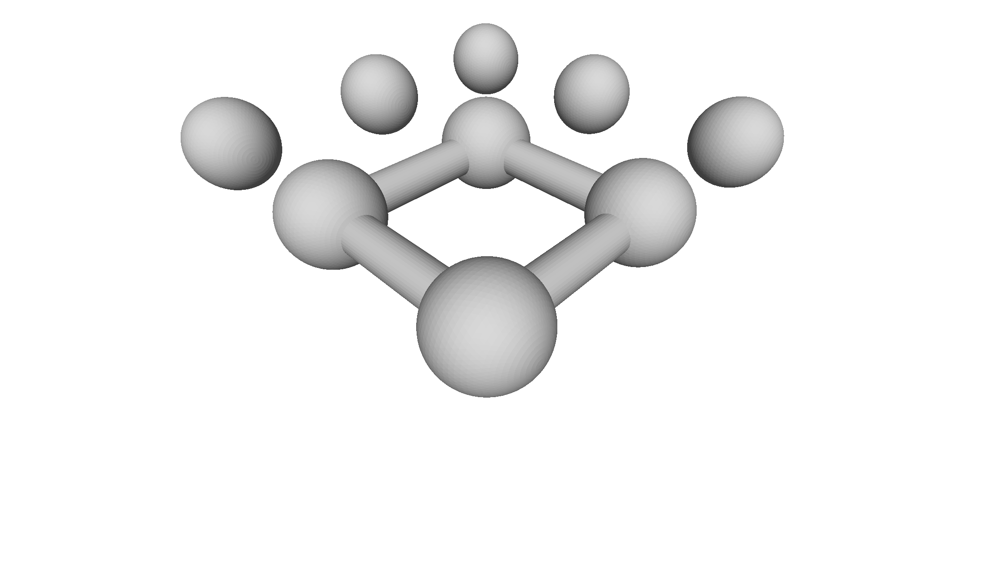
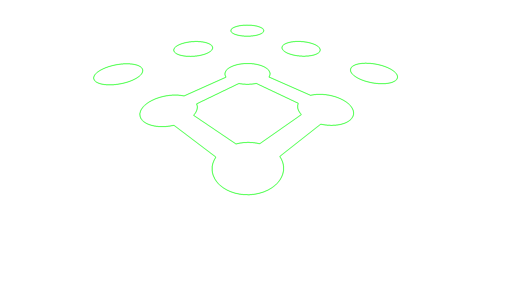
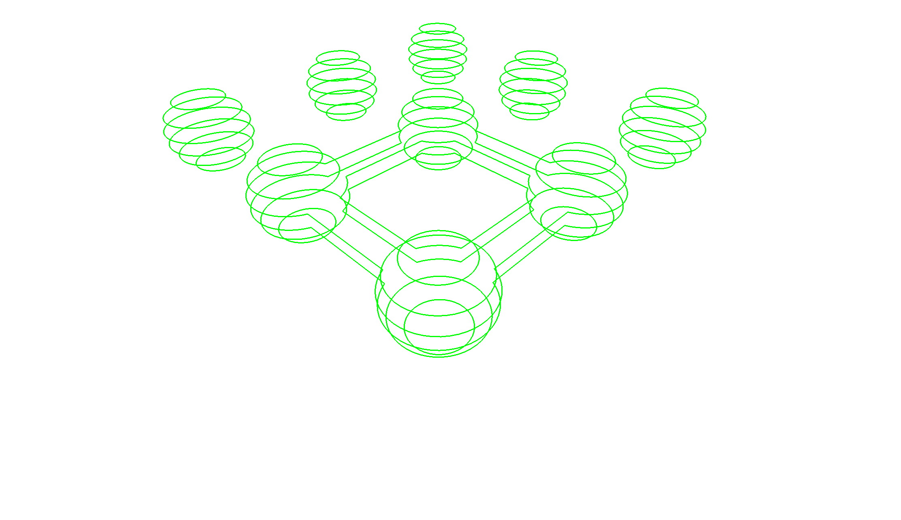
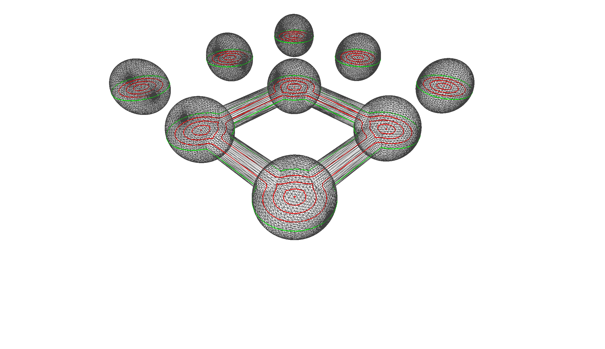
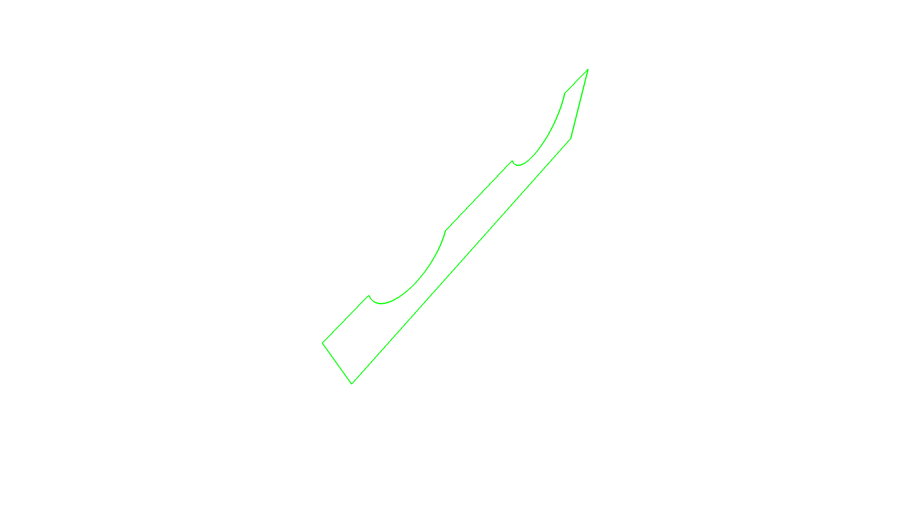
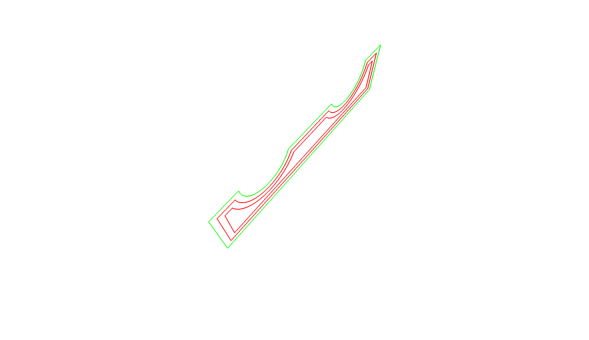
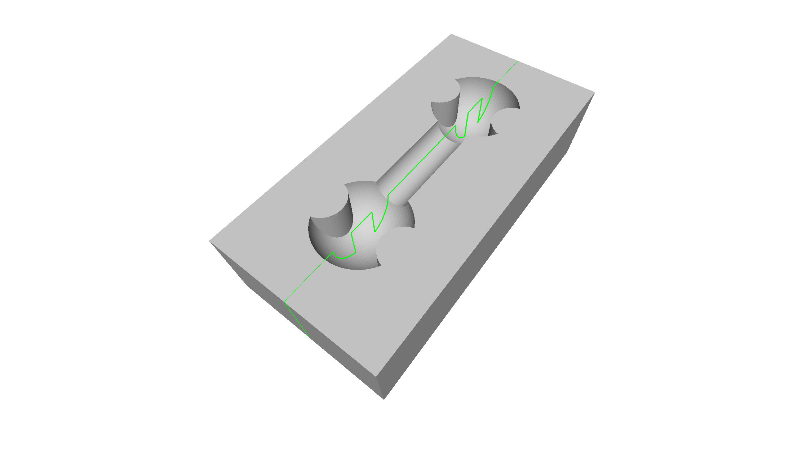
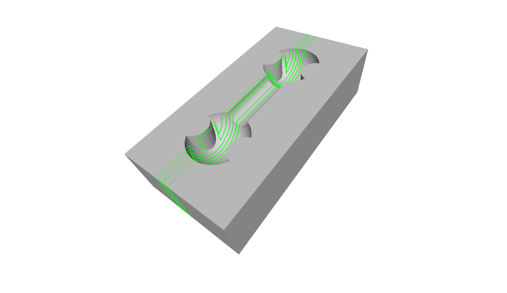

# STEPToXSection
The program STEPToXSection extracts the contour of a planar cross section of solids contained in STEP files. Additionally it supports offsetting of the cross section contour.

# Description
The program STEPToXSection is a command line utility to export the contour of a planar cross section of solids contained in STEP files. It supports the orthogonal projection of geometries with a specified maximum plane distance, in which the silhouette of the projected geometries represents the base contour. Additionally the program supports the computation of contour offset curves. The contour is a list of line segments. The supported output file formats are ply and xyz. In the case of xyz, two consecutive vertices belong to the same edge. A popular viewer for the different file types is MeshLab (https://www.meshlab.net). STEPToXSection is based on OpenCASCADE (https://www.opencascade.com). The program uses cxxops (https://github.com/jarro2783/cxxopts) for parsing the command line.

# Requirements
 * CMake installation (https://cmake.org)
 * Visual Studio C++ installation (https://visualstudio.microsoft.com)
 * OpenCASCADE installation (https://old.opencascade.com/content/latest-release, download needs registration)

# Usage
Listing the contents (solids) of a STEP file:
`STEPToXSection -c -i <step file>`

Computing the planar cross section contour of the overall file content (solids):

`STEPToXSection -i <step file> -o <output file> -d <deflection> -p <plane>`

The parameter `<deflection>` controls the resolution of the approximation with line segments.

Computing the planar cross section contour of selected solids of the file:

`STEPToXSection -i <step file> -o <output file> -d <deflection> -p <plane> -s <solid1>,<solid2>,<...>`

In order to change the default output format xyz the command line argument `-f ply`has to be specified.

Following the help text from the command line:
```
STEPToXSection.exe
Extracts the contour of a planar cross section of solids contained in STEP files. It supports the orthogonal projection of geometries with a specified maximum plane distance, in which the silhouette of the projected geometries represents the base contour. Additionally the program supports the computation of contour offset curves.
Usage:
  STEPToXSection [OPTION...]

  -i, --in arg          Input file
  -o, --out arg         Output file
  -f, --format arg      Output file format (xyz or ply) (default: xyz)
  -c, --content         List content (solids)
  -s, --select arg      Select solids by name or index (comma seperated list,
                        index starts with 1)
  -d, --deflection arg  Chordal tolerance used during discretization
  -p, --plane arg       Single plane (a,b,c,d) or parallel planes
                        (a,b,c,d_start,d_end,d_count), in which a*x + b*y + c*z + d = 0
  -t, --offset arg      Single offset (value) or range offset
                        (start,end,count) for computation of contour offset curves
  -n, --projection arg  Orthogonal projection of geometries with specified
                        maximum plane distance, in which the silhouette of the
                        projected geometries represents the base contour
  -h, --help            Print usage
```

# Examples

Examples `spheres.stp` and `bone_pocket.stp` are from the `examples` directory.

## Examples Spheres

| Solids |
| :---: |
|  |

| Planar cross section |
| :---: |
| `STEPToXSection.exe -i ..\..\..\examples\spheres\spheres.stp -o out.ply -f ply -d 0.01 -p 1.0,0.0,0.0,0.0` |
|  |

| Planar cross sections |
| :---: |
| `STEPToXSection.exe -i ..\..\..\examples\spheres\spheres.stp -o out.ply -f ply -d 0.01 -p 1.0,0.0,0.0,-4.0,4.0,6` |
|  |

| Positive offset curves |
| :---: |
| `STEPToXSection.exe -i ..\..\..\examples\spheres\spheres.stp -o out.ply -f ply -d 0.01 -p 1.0,0.0,0.0,0.0 -t 0.0,10.0,10` |
|  |

| Negative offset curves |
| :---: |
| `STEPToXSection.exe -i ..\..\..\examples\spheres\spheres.stp -o out.ply -f ply -d 0.01 -p 1.0,0.0,0.0,0.0 -t 0.0,-4.9,5` |
|  |

## Example Bone Pocket

| Solid |
| :---: |
|  |

| Planar cross section |
| :---: |
| `STEPToXSection.exe -i ..\..\..\examples\bone_pocket\Bone_Pocket.stp -o out.ply -f ply -d 0.01 -p 0.0,0.0,1.0,0.0` |
|  |

| Planar cross sections |
| :---: |
| `STEPToXSection.exe -i ..\..\..\examples\bone_pocket\Bone_Pocket.stp -o out.ply -f ply -d 0.01 -p 0.0,0.0,1.0,-4.0,4.0,5` |
|  |

| Positive offset curves |
| :---: |
| `STEPToXSection.exe -i ..\..\..\examples\bone_pocket\Bone_Pocket.stp -o out.ply -f ply -d 0.01 -p 0.0,0.0,1.0,0.0 -t 0.0,4.0,5` |
|  |

| Negative offset curves |
| :---: |
| `STEPToXSection.exe -i ..\..\..\examples\bone_pocket\Bone_Pocket.stp -o out.ply -f ply -d 0.01 -p 0.0,0.0,1.0,0.0 -t 0.0,-2.0,3` |
|  |

| Silhouette projected geometry |
| :---: |
| `STEPToXSection.exe -i ..\..\..\examples\bone_pocket\Bone_Pocket.stp -o out.ply -f ply -d 0.01 -p 0.0,0.0,1.0,0.0 -n 3.0` |
|  |

| Silhouettes projected geometry |
| :---: |
| `STEPToXSection.exe -i ..\..\..\examples\bone_pocket\Bone_Pocket.stp -o out.ply -f ply -d 0.01 -p 0.0,0.0,1.0,2.5,0.0,6 -n 1.0` |
|  |

# Remarks
This code has been tested with an OpenCASCADE 7.5.0 prebuilt binary (`opencascade-7.5.0-vc14-64.exe`) on Windows, as well as OpenCASCADE system packages on openSUSE Linux. With changes in the configuration section in the `CMakeLists.txt` file the build should also work with other OpenCASCADE versions.